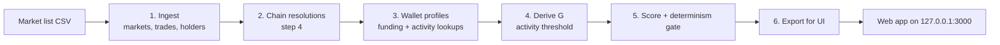

# Anomaly Radar

Anomaly Radar ranks Polymarket wallets by how unusual their betting pattern looks on a chosen set of markets
(built for the 2026 US–Iran strike markets). It reads public data only, from Polymarket's public APIs and the
Polygon blockchain. It computes eight behavioural signals per wallet and combines them into an
**anomalous pattern score** from 0 to 1. A local web app lets you browse the ranking, individual wallets,
linked wallets and each market's holders.

> **Status: research prototype, unvalidated.**
> A high score is a statistical flag for review. It is not proof of anything and it says nothing about who owns
> a wallet. The tool never names people and never claims that linked wallets belong to one owner.
> It is read-only: it never trades, signs transactions or contacts anyone.

---

## Contents

- [How it works](#how-it-works)
- [The eight signals](#the-eight-signals)
- [Requirements](#requirements)
- [Setup](#setup)
- [Running the pipeline](#running-the-pipeline)
- [Running the web app](#running-the-web-app)
- [Tests](#tests)
- [Reproducibility rules](#reproducibility-rules)
- [Repository layout](#repository-layout)
- [Data and privacy](#data-and-privacy)
- [License](#license)

---

## How it works



1. **Ingest** pulls each market's metadata, every trade (two independent walks of the trade API), holders,
   positions and resolutions into an immutable snapshot (`data/snapshots/SNAP-NNN`).
2. **Chain resolutions** reads each market's on-chain `ConditionResolution` event, so resolution times come from
   the chain rather than from the API.
3. **Wallet profiles** fetch, for every wallet that passes the prefilter, its first activity, lifetime stats,
   redemptions and direct funding transfers (USDC.e, USDC, pUSD), plus an activity count for every shared
   counterparty. Each file records which code version wrote it.
4. **Derive G** computes, before any scoring, the activity threshold above which a counterparty counts as a
   shared service (exchange, relay, deposit address) rather than a private link. It uses a formula fixed in advance.
5. **Score** computes the eight signals and the weighted score. A run counts only if it passes the
   **determinism gate**: two single-thread runs must be byte-identical and a four-thread run row-identical.
6. **Export** writes the few columns the web app needs as JSON. Internal columns are refused by a guard.

A wallet is scored only if it passes the **prefilter**: at least 1,000 USDC staked on outcomes priced below
0.20, before the market resolved.

---

## The eight signals

| Code | Signal | What it measures |
|---|---|---|
| S1 | Fresh wallet | Funded shortly before its first large bet |
| S2 | Concentration | Share of the wallet's lifetime activity that sits in these markets |
| S3 | Low-odds stake | Money staked on outcomes priced below 20% |
| S4 | Pre-event timing | Bets placed shortly before the real-world event occurred |
| S5 | Improbable wins | Long-shot wins far above chance (exact p-value, "k of n bets won") |
| S6 | Linked wallets | Direct funding counterparties shared with other scored wallets, excluding high-activity services |
| S7 | Coordinated buys | The same low-odds outcome bought within minutes by other wallets |
| S8 | Exit behaviour | How and when winnings were cashed out |

Each signal gives a value from 0 (nothing unusual) to 1 (very unusual), or **NA** when there is no data.
NA adds nothing to the score and is never treated as zero; every NA carries a reason. A signal that is NA for
every wallet in a run gets weight 0, and the remaining weights are shared out.

---

## Requirements

- Python 3.11–3.13 and [uv](https://docs.astral.sh/uv/)
- Node.js 20 or newer and npm (only for the web app)
- Internet access for the fetch steps (public endpoints; no account needed)
- Disk: a full snapshot plus profiles for ~170 markets is a few GB

Optional: a [Dune](https://dune.com) API key for the Dune cross-check source.

---

## Setup

```bash
git clone https://github.com/TJalam-com/anomaly-radar.git
cd anomaly-radar
uv sync
```

Optional secrets go in `.env`, which is git-ignored:

```bash
cp .env.example .env
# then edit .env and set DUNE_API_KEY=... if you use Dune
```

The Polygon RPC and Polymarket API endpoints are public and built in; no key is needed for them.
**Never commit `.env`.**

---

## Running the pipeline

All commands run from the repository root. Each step writes a new, dated directory under `data/` and never
overwrites an earlier one.

### 1. Ingest the markets

Give it one or more condition ids, or a CSV whose `include` column marks the markets to ingest:

```bash
uv run python -m radar.ingest --condition 0x<condition_id>
uv run python -m radar.ingest --m-csv markets.csv
```

Output: `data/snapshots/SNAP-NNN/` with raw responses, derived parquet tables and a manifest of hashes.
A market is refused (not loaded) if its lookups disagree, for example if the two trade walks return mismatched counts.

### 2. Add on-chain resolution times

```bash
uv run python -m radar.step4 --snap data/snapshots/SNAP-NNN
```

### 3. Fetch wallet profiles

Profiles must be written by a pinned code version. First print this build's writer id:

```bash
uv run python -m radar.profile --snap data/snapshots/SNAP-NNN --prof data/profiles/PROF-NNN \
  --params config/params_frozen_2026-09-27_v3.toml --prof-id PROF-NNN --print-writer-id
```

Add a line for it to your pin ledger (`../ledger/WRITER_PINS.md`, next to the repository, or pass `--pins <file>`):

```
PIN | PROF-NNN | <writer_id> | <UTC instant> | QA
```

Then fetch. The run is resumable, and it stops on the first rate-limit response:

```bash
uv run python -m radar.profile --snap data/snapshots/SNAP-NNN --prof data/profiles/PROF-NNN \
  --params config/params_frozen_2026-09-27_v3.toml --prof-id PROF-NNN --workers 1
```

Use `--limit 25` for a small trial run first.

### 4. Derive the activity threshold G

```bash
uv run python tools/derive_g.py --snap data/snapshots/SNAP-NNN --prof data/profiles/PROF-NNN \
  --params config/params_frozen_2026-09-27_v3.toml --out g_record.json
```

Record the printed `GREC` line in `../ledger/G_RECORDS.md` (or pass `--g-records <file>`). The scorer refuses S6
until the record is listed there. Only the last line per profile set counts.

### 5. Score, with the determinism gate

Scoring needs a weights file and its lock (the lock is the sha256 of the file):

```toml
# config/weights.toml
[weights]
S1 = 1.0
S2 = 1.0
S3 = 1.0
S4 = 1.0
S5 = 1.0
S6 = 1.0
S7 = 1.0
S8 = 1.0
```

```bash
sha256sum config/weights.toml | cut -c1-64 | tr -d '\n' > config/weights.toml.lock
```

Run the gated score (three runs; the verdict lands in `gate.json`, and a failed run is renamed `…+VOID`):

```bash
uv run python -m radar.gate --snap data/snapshots/SNAP-NNN --weights config/weights.toml \
  --params config/params_frozen_2026-09-27_v3.toml --prof data/profiles/PROF-NNN \
  --g-record g_record.json --event-times event_times.csv
```

Useful options of `radar.score` (and `radar.gate`):

| Option | Effect |
|---|---|
| `--prof` | Profile set; without it S1, S2, S6 and S8 are NA |
| `--event-times` | Event-times CSV for S4; without it S4 is NA |
| `--s6-edges in` | Sensitivity run using inbound funding only |
| `--override S1=0` | Derived weights (hashed separately) |
| `--tag` | Label added to the run id |

The scorer accepts only the project's own event-times table by its sha256. To use your own table, also pass
`--event-times-sha <sha256 of your file>`. Runs that use your own event-times table or ledgers are still produced,
but `run.json` marks them as not eligible for the validation report.

### 6. Export a run for the web app

```bash
uv run python ui/scripts/export_ui_data.py data/runs/<run_id> data/snapshots/SNAP-NNN ui/data/<run_id> \
  --run-label "My run" --banner "interim data: pre-validation"
```

Add `--profile-label` to name the profile set in the footer, and `--profile-unverified` when the profile writer
was not pinned. Put the default run's id in `ui/data/DEFAULT_RUN`.

---

## Running the web app

```bash
cd ui
npm ci
npm run dev
```

Open <http://127.0.0.1:3000/>. It binds to localhost only and reads the JSON under `ui/data/`.
The npm scripts set environment variables in Unix style; on Windows run them from Git Bash or WSL.
Production build: `npm run build:review`, then `node serve.js --dist .next-stage`.

What you will find:

- **Leaderboard**: ranked wallets with a pager, filters (minimum score, signal has data), sorting, a
  "driven by" line and an exact "how it adds up" breakdown for each score.
- **Wallet page**: summary cards, score in every market and event, signal cards with evidence and NA reasons,
  linked wallets, a bet timeline and the full bet table.
- **Link page**: every counterparty two wallets share, with direction and hop.
- **Markets and market page**: outcome, on-chain resolution, volume, a bubble map of the top holders, and a CSV
  download of all holders.
- **How to use** and **What is this score?**: in-app explanations.

Every score carries a trust label ("unvalidated") and every page a source footer that identifies the exact
data, weights and settings behind it.

---

## Tests

```bash
uv run pytest
```

Tests never touch the network (sockets are blocked in `tests/conftest.py`).

The break harness plants faults into a mirror copy of the code and checks that the named test catches each one,
three times over. A fault that is only sometimes caught counts as a failure, and so does an ambiguous edit
target:

```bash
uv run python tools/break_g4.py
```

For the web app's data export:

```bash
cd ui
uv run python -m pytest -q scripts/test_export.py
```

---

## Reproducibility rules

- **Frozen settings.** Every threshold lives in `config/params_frozen_*.toml`; each file has a `.lock` holding
  its sha256, and a changed file means a new version, never an edit.
- **Immutable outputs.** Snapshots, profile sets and runs are never rewritten; every file is listed with its hash
  in a manifest.
- **Pinned writers.** Profiles and the activity threshold are accepted only when their code version or record
  is pinned in a ledger.
- **Determinism gate.** A score run that is not byte-identical across repeats is void.
- **No hindsight in replay.** Replay-style scoring sees only data from before each cut-off (enforced in code).

---

## Repository layout

```
radar/        ingest, chain resolutions, profiles, signals, scoring, determinism gate, weight search
  vendor/     third-party entity seed list (MIT, attribution kept)
tools/        measurement tools, derive_g, dry-run report, break harness
tests/        unit tests and fixtures (network blocked)
config/       frozen parameter files + locks
docs/         design notes in revision order (D1_design_note*.md)
ui/           Next.js + Tailwind web app, export script and its tests
```

---

## Data and privacy

- No data is included in this repository. Snapshots, profiles, runs and exported JSON are generated locally
  and are git-ignored.
- All inputs are public: Polymarket's public APIs and the Polygon blockchain.
- Wallets are identified only by address. The app shows behaviour, not identities.

---

## License

MIT, see [LICENSE](LICENSE). `radar/vendor/pselamy_entity_data.py` is vendored under its own MIT license,
included next to it.
